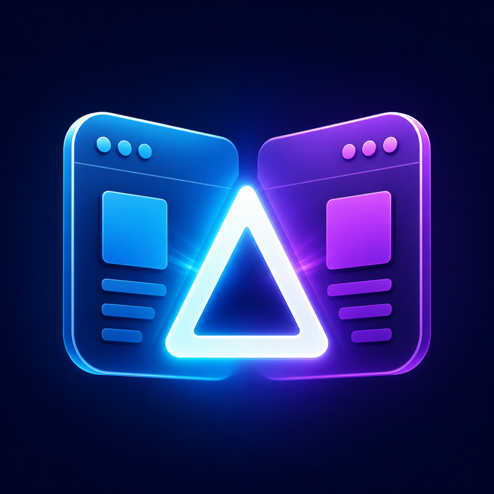
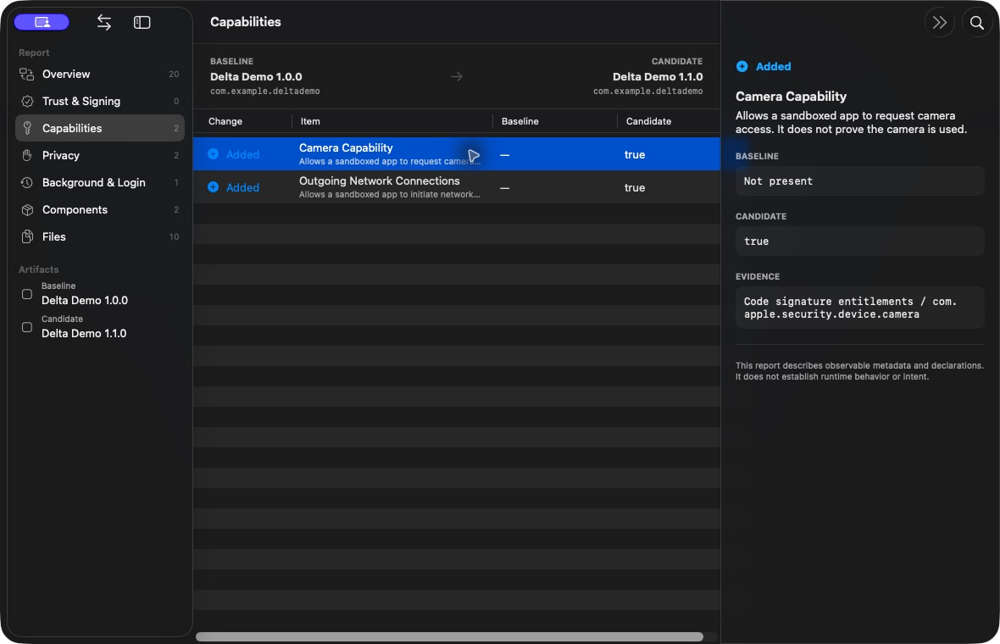

# App Delta

<p align="center">
  
</p>

**See what changed inside two macOS app builds before you replace one with the other.**

App Delta is a local, native macOS comparison tool for `.app`, `.dmg`, `.pkg`,
and `.mpkg` artifacts. It explains changes in versions, code signatures,
entitlements, privacy declarations, background helpers, embedded components,
and files without launching the inspected software or uploading its contents.

> App Delta reports observable differences. It does **not** decide whether an
> application is safe, malicious, trustworthy, or suitable to install.

[한국어 문서](README_KO.md) · [Implementation plan](IMPLEMENTATION_PLAN.md)

[Download the latest macOS preview](https://github.com/JongHyun070105/app-delta/releases)



## What it compares

- Identity: display name, bundle ID, version, build, deployment target, SDK, size
- Trust metadata: signature validity, certificate chain, Team ID, Hardened
  Runtime, App Sandbox, and Gatekeeper assessment
- Declared capabilities: code-signing entitlements with plain-language context
- Privacy: `Info.plist` usage descriptions and `PrivacyInfo.xcprivacy` manifests
- Persistence: login items, LaunchAgents, and LaunchDaemons bundled in the app
- Components: executables, frameworks, XPC services, extensions, plug-ins,
  nested apps, and dynamic libraries
- Files: type, executable bit, size, and bounded SHA-256 content fingerprints

Every changed row is labeled `Added`, `Removed`, or `Changed` and can be opened
in an inspector showing its before/after values and evidence path.

## Download and install

Download the universal macOS DMG from [GitHub Releases](https://github.com/JongHyun070105/app-delta/releases),
open it, and drag **AppDelta** into **Applications**. The preview build supports
Apple Silicon and Intel Macs.

> Current GitHub binaries are ad-hoc signed and not Apple-notarized. macOS may
> require Control-clicking the app and choosing **Open**. A normal double-click
> install requires a Developer ID certificate and Apple notarization.

## Build and run from source

Requirements: macOS 14 or later and Xcode 16 or later.

```bash
git clone https://github.com/JongHyun070105/app-delta.git
cd app-delta
./script/build_and_run.sh
```

The script builds a normal app bundle at `dist/AppDelta.app` and launches it.
Other development commands:

```bash
swift test                              # unit + secure artifact integration tests
./script/build_and_run.sh --verify      # build, launch, and verify code signing
./script/build_and_run.sh --package     # release ZIP in dist/
./script/create_demo_fixtures.sh        # two non-runnable comparison fixtures
```

## Using App Delta

1. Drop or choose the older build as **Baseline**.
2. Drop or choose the new build as **Candidate**.
3. Click **Compare Artifacts**.
4. Browse categories, search, set a minimum severity, and select a change for
   its evidence.
5. Export a self-contained HTML report or structured JSON when needed.

Keyboard shortcuts are available from the **Comparison** and **Export** menus.

### Comparing a built-in app update

If an app replaces itself during an update, the old bundle is normally lost.
Before updating, click **Prepare App Update…** and select the installed app.
App Delta stores a compact analysis snapshot—not a copy of the application—and
keeps that app path as Candidate. Run the update normally, return to App Delta,
and compare. Saved snapshots remain available from **Saved Baselines…**.

If the update already happened, App Delta cannot reconstruct the replaced
files. Use an older DMG, vendor/GitHub release, or Time Machine copy as Baseline.

Use **Help → App Delta Help** for the built-in searchable Q&A.

### Language

App Delta follows the Mac's language by default and currently supports English
and Korean. Switch instantly from the globe button in the toolbar, the
**Language** app menu, or **App Delta → Settings**. Changing the language keeps
the current comparison open and also localizes newly exported HTML reports.

## Local-analysis and safety model

App Delta does not contain analytics, accounts, databases, or an upload client.
It uses allowlisted macOS tools with argument arrays rather than a shell. The
selected artifact is never launched.

- `.app` bundles are read directly.
- `.dmg` images are verified, attached read-only with Finder browsing disabled,
  scanned, detached, and cleaned up.
- `.pkg` / `.mpkg` installers are **not installed**. App Delta reads signature
  metadata and a bounded payload-path inventory; package scripts never run.
- Symlinks are recorded but not followed. Enumeration depth, entry count,
  command duration/output, and file hashing are bounded.
- HTML export escapes artifact-controlled values and includes a restrictive
  Content Security Policy.

Gatekeeper assessment uses the macOS trust service and may reflect the current
machine's trust policy and cached notarization state. Accepted, rejected, and
unavailable assessments are kept separate with their diagnostic evidence; none
is converted into a malware verdict.

## Current v1 limits

- A DMG containing multiple applications is compared using the first shallowest
  app and reports that choice as an analysis note.
- Package comparison intentionally stops at metadata and payload paths; it does
  not unpack arbitrary installer payloads.
- SHA-256 hashing stops at a 512 MB per-artifact safety budget, after which files
  are compared by metadata only.
- Preview DMGs are ad-hoc signed and unnotarized. Public stable distribution
  still requires Developer ID signing and Apple notarization.

## Contributing

Issues and focused pull requests are welcome. Please run `swift test` and
`./script/build_and_run.sh --verify` before submitting changes.

App Delta is available under the [MIT License](LICENSE).
